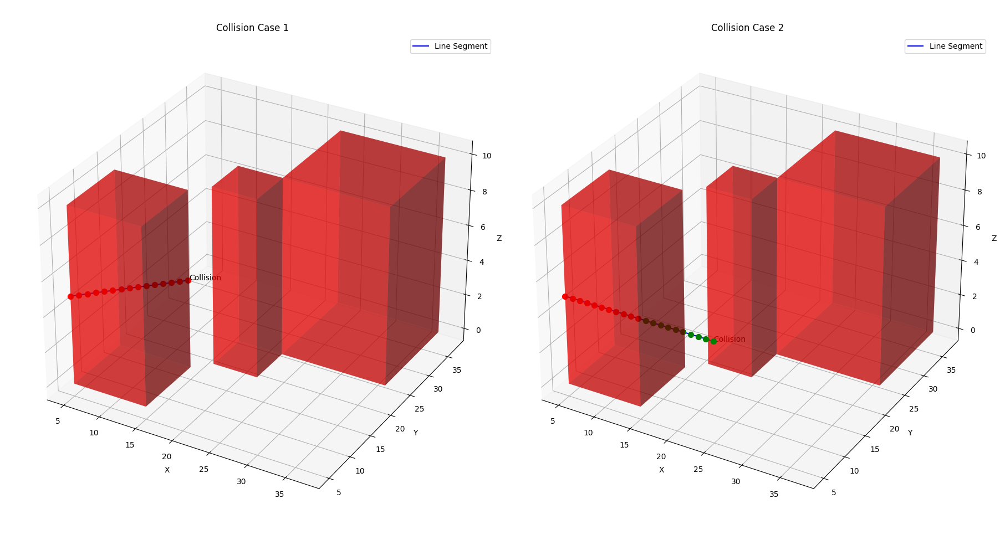
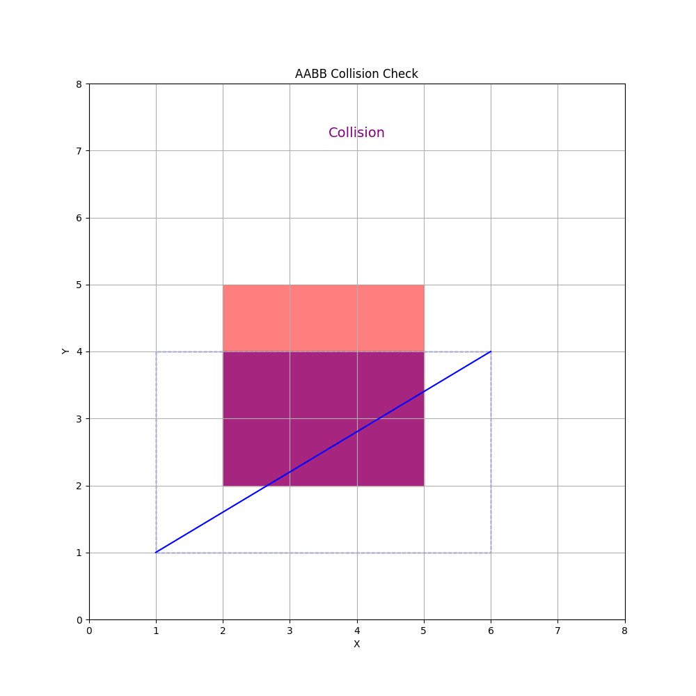

# Collision Detection
For this project, I've employed two main methods for collision detection: The Axis Aligned Bounding Box (AABB) method and what I call the "stepwise" method. Both methods have their own strengths and weaknesses, so I will reflect on those briefly. I will also explain how each works in the context of this project and also show a visual representation of each method in action.

To better understand the context, obstacles in this project are represented by 3D boxes. Furthermore, for a path to be valid, line segments connecting any two subsequent path points must not intersect with any obstacle.

### Mathematical Formulation of the Collision Detection Problem
In the context of this project, the problem of collision detection is more specifically the problem of collision detection of a 3D box with a line segment defined by two points. Each obstacle 3D box is defined by its center points and its dimensions (halfsizes). Furthermore, each line segment is defined by two points in $\mathbb{R}^3$. 

To further elaborate, defining one obstacle requires six parameters: $x, y, z, h_x, h_y, h_z$. The drone's environment is defined by a collection of N obstacles. Moreover, defining one line segment requires six parameters: $x_1, y_1, z_1, x_2, y_2, z_2$. The drone's path is defined by a collection of M line segments. 

#### The Neccessary and Sufficient Condition for Collision of a Single Point with a Single Obstacle

Given this context, a criterion that is both necessary and sufficient to indicate a collision between a single point and any obstacle is that the point must lie inside of the obstacle box. 

In other words, a point $(x, y, z)$ collides with an obstacle box, defined as having center $(o_x, o_y, o_z)$ and halfsizes $(h_x, h_y, h_z)$, if and only if the following conditions are met:

1. $x \in [o_x - h_x, o_x + h_x]$
2. $y \in [o_y - h_y, o_x + h_y]$
3. $z \in [o_z - h_z, o_z + h_z]$

Of course, it's entirely impractical to conduct collision checking on all points belonging to a line segment, the reason being there would be infinitely many points to check. So what we do instead is employ collision detection methods that approximate the results of this process. 

## The Stepwise Method

The first way I do this is by discretizing the line segment into a collection of points and then check each of those points for collision with each obstacle. I call this the stepwise method.

What I've learned from integrating this collision detecting method with my path planning codes, such as RRT and A* search, is that this method is computationally expensive but can be highly accurate. The reason that this method is computationally expensive is that the number of points required to be checked scales linearly with the length of the line segment and the resolution of the discretization. The reason this method can be highly accurate is that a line segment is well represented by a collision of points, so long as the resolution of the discretization is high enough.

The following pair of visualizations give an indication of how the stepwise method works:

## The Axis Aligned Bounding Box (AABB) Method

The second way I employ collision checking in my collection of pathfinding codes is with what is referred to in the literature as the Axis Aligned Bounding Box (AABB) method. The way this method works is by checking for an intersection between a bounding box drawn around the line segment and a bounding box drawn around the obstacle. 

What I've learned from experimenting with this collision detection method is that it tends to be less computationally expensive than approaches that work by discretizing the line segment a set of basis points, but it also tends to be less accurate. The reason this is that the repeated checking of points is replaced by a single check for the presence of overlap between two bounding boxes. The reason this method tends to be less accurate, though, is that line segments are not always well represented by bounding boxes. In the case of this project, AABB checking frequently leads to false positive results, that is the detection of collisions that do not actually exist. The reason for this is that the drone's mission environment is a dense colliection of obstacles with many narrow passageways.

The following visualization gives an indication of how the AABB method works and also gives an indication of why it is prone to false positives:

