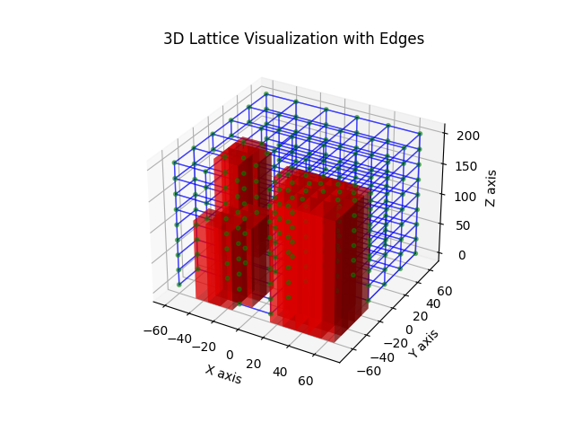
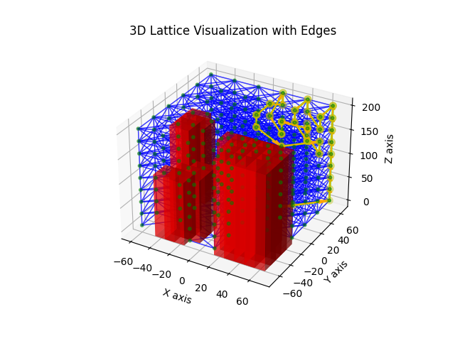
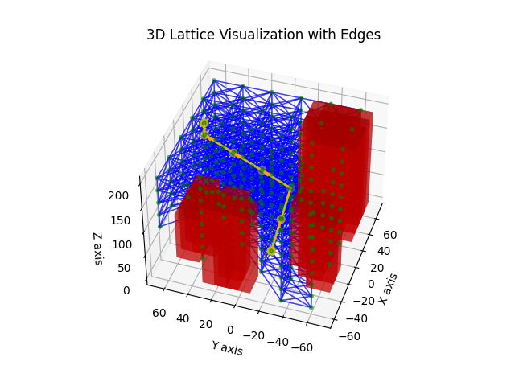

# Deterministic Pathfinding Algorithms

One major category of pathfinding approaches I discovered while working on this project is what I refer to as the deterministic approach to pathfinding. This approach requires free space to be modeled explicitly as either a grid or a graph structure. The approach also requires the implementation of a pathfinding algorithm that operates on grids or graphs. 

There exist countless algorithms that operate on grid or graph structures and return a path from a start node to a goal node. Each of these algorithms has its own strengths and weaknesses. 

One of the major learning themes of this project for me was exploring those strengths and waaknesses. The way I did this was be choosing a subset of such pathfinding algorithms and implementing them from scratch. The process of experimenting with each algorithm led me to ultimately decide that the A* algorithm seemed most suitable for my project.

## Constructing Free Space

All algorithms of this particular category require free space to be modeled explicitly as either a grid or a graph structure. So part of my work was in writing code to construct that structure from the raw list of static obstacle geometry. 

The result of my work is a set of codes that construct a graph structure that takes the geometric form of a cubic lattice arrangement. I've made the codes flexible enough such that any user using the codes can specify the size of the cubic lattice, the spacing between nodes, whether nodes are connected to their diagnoal neighbors or not, and other such parameters. 

The following visualizations exemplify the graph structure my codes construct: 

## Breadth First Search
I've learned that breadth first search is a reasonable choice of algorithm for finding shortest distance paths but that it's not as good as the A* algorithm. BFS will always find a shortest distance path when a path between two nodes exists. However, the way it ultimately finds that path is through a process that is rather inefficient. Also, BFS will tend to return non-shortest-distance paths when the graph structure it's operating on contains edges of unequal spacing. 

I've also learned that BFS can be used to find shortest-distance paths in other contexts, also. For example, while working on this project, there were a couple times when I employed BFS to find a shortest distance path through an occupancy grid representation of free space, where the position of the start node was known but the position of the goal node was not. In such cases, I knew that I wanted BFS to stop when it reached the first free node of the occupancy grid. 

## Depth First Search
It only took a few experiments with DFS to understand that the algorithm was not at all suitable for the type of pathfinding I was doing in this project. From my own experiments, I discovered that DFS will always find a valid path between two nodes if one exists but will tend to return a path that is not at all shortest-distance. 

The following visualization shows why DFS should not be used for pathfinding tasks for this project: 

## Uniform Cost Search
I reason that, in the specific context of my project, uniform cost search represents an improvement over BFS but is still not as good as A*. The reason for this is, unlike BFS, UCS considers the distance between adjacent nodes when deciding which node to visit next yet will, nonetheless, always return the shortest-distance path when a path between the start and goal nodes exists. 

That beind said, considering the complete context of this project, UCS is not as well suited as A* for shortest-distance pathfinding between two points in free space. 

## A* Search
I've come to understand that A* is the best of the pathfinding algorithms I've chosen to experiment with. A* will always find the shortest-distance path when one exists. A* also finds the path more efficiently than does BFS, UCS, or DFS. The reason for this is that A* employs what's called a heursitic function to guide its search. 

The following visualization typifies the result of my A* implementation: 
