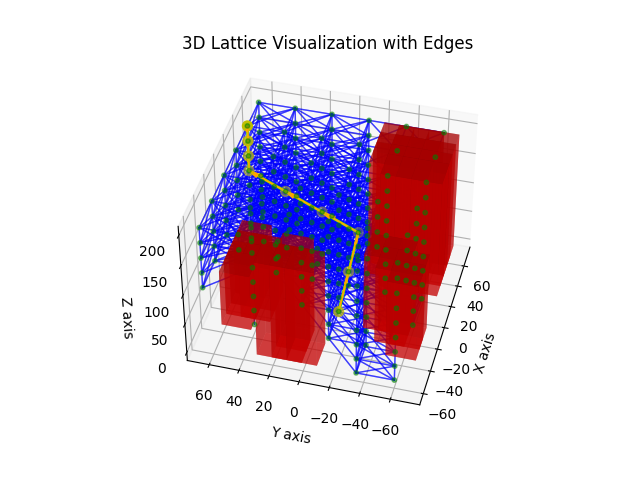
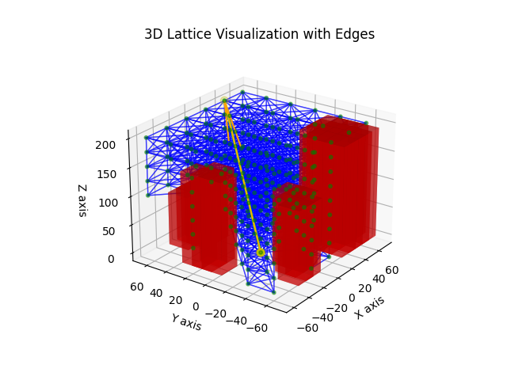

# Shortcut Algorithm

It's not always desirable to keep all of the waypoints returned by a path planning algorithm. 

The shortcut algorithm removes unnecessary waypoints from a path while ensuring the path remains collision-free. It iteratively checks if the line segment between the first and last points in the path intersects with any obstacles. If an intersection is found, it incrementally moves the endpoint closer to the start point and rechecks. This process is repeated, progressively shortening the path by removing intermediate points that are not needed for collision-free navigation. The result is a list of waypoint indices representing a shorter, collision-free path.

The following pair of visualizations represents a before and after comparison of the shortcut algorithm applied to a path and does well to typify the effet of appling the shorcut algorithm to a path. 

	
	

