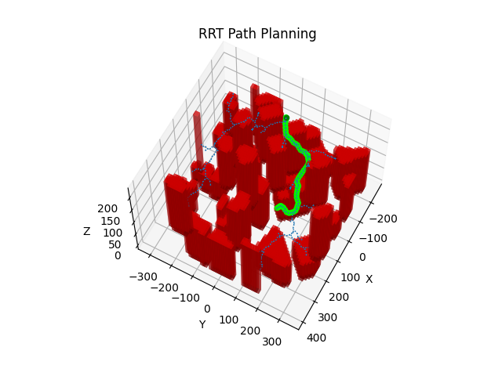

# Stochastic Pathfinding Algorithms

## Rapidly Exploring Random Tree 
For this arm of the project, I customized a well-known pathfinding algorithm, rapidly exploring random tree (RRT), which works by growing a tree from a start state to a goal state according to a random sampling process. Noteable, I modified the baseline implementation of the RRT algorithm in two ways to produce the algorithm demonstrated in this code base. I modified the RRT algorithm to feature a custom steering function and to include a goal biasing feature.

The algorithm tends to produce collision-free, non-jagged paths because the tree is expanded according to a process that must conform to a kinematic constraint model similar to Dubin's Car. The algorithm is not computationally cheap, however, due to the fact that it relies on Euler integration with small time steps to integrate forward over long distances.

The following figure illustrates a typical resulting path produced by the algorithm I developed:

## The Basic algorithm
## My Modifications
### Steering 
### Goal Biasing
## Results

