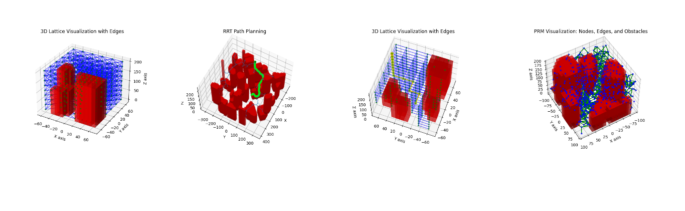

# Drone Algorithms Project
This project contains a collection of algorithms and demos for drone motion planning, dynamics modeling, and controller design. The project is divided into three main sections: motion planning algorithms, dynamics models, and controller models. Each section contains a collection of algorithms and demos that can be used to simulate and visualize the behavior of drones in different scenarios.



NOTE: This repository is still under development. I am making changes to the codebase and adding new features. For this reason, there may temporarily be some broken links or missing files. I am working to fix these issues as soon as possible.

## Project Navigation
1. [Motion Planning Demos](motion_planning_demos)
    1. [Deterministic Pathfinding](motion_planning_demos/deterministic_pathfinding_algorithms/)
        1. [A* Search](motion_planning_demos/deterministic_pathfinding_algorithms/a_star_search.py)
        1. [Breadth First Search](motion_planning_demos/deterministic_pathfinding_algorithms/breadth_first_search.py)
        1. [Depth First Search](motion_planning_demos/deterministic_pathfinding_algorithms/depth_first_search.py)
        1. [Uniform Cost Search](motion_planning_demos/deterministic_pathfinding_algorithms/uniform_cost_search.py)
    2. [Stochastic Pathfinding](motion_planning_demos/stochastic_pathfinding_algorithms/)
        1. [Probabilistic Roadmap](motion_planning_demos/stochastic_pathfinding_algorithms/prm.py)
        1. [Rapidly Exploring Random Tree](motion_planning_demos/stochastic_pathfinding_algorithms/rrt_with_steering.py)
    3. [Potential Field](motion_planning_demos/potential_field_pathfinding_algorithms/)
        1. [Potential Field Model 1](motion_planning_demos/potential_field_pathfinding_algorithms/rhp_model_1.py)
        1. [Potential Field Model 2](motion_planning_demos/potential_field_pathfinding_algorithms/rhp_model_2.py)
    4. [Trajectory Planning](motion_planning_algorithms)
        1. [Minimum Snap Trajectory](motion_planning_demos/trajectory_planning_algorithms/seventh_order_polynomial.py)
    5. [Free Space Construction](motion_planning_demos/free_space_construction/)
        1. [Constructing the Environment](motion_planning_demos/free_space_construction/environment_data.py)
        1. [Constructing Free Space Lattice Structure](motion_planning_demos/free_sace_construction/lattice.py)
2. [Dynamics Models](dynamics_models)
    1. [Monorotor](dynamics_models/monorotor/)
    2. [Birotor](dynamics_models/birotor/)
    3. [Quadrotor](dynamics_models/quadrotor/)
3. [Controller Demos](control_demos)
    1. [Monorotor Controller](control_demos/monorotor/)
    2. [Birotor Controller](control_demos/birotor/)
4. [Hardware Prototyping](drone_hardware_prototyping)
1. [Telemetry Data Processor](telemetry_data_processor/)

## Documentation
1. [The Story Behind This Project](docs/the_story_behind_this_project.md)
2. [Formulating the Path Planning Problem in Detail](docs/understanding_the_path_planning_problem_in_detail.md)
3. [Trajectory Planning](docs/trajectory_planning_algorithms_.md)
4. [Collision Detection](docs/collision_detection.md)
5. [Deterministic Pathfinding](docs/deterministic_pathfinding_algorithms.md)
6. [Stochastic Pathfinding](docs/stochastic_pathfinding_algorithms.md)
7. [Dynamics Models](docs/dynamics_models.md)
8. [PID Controllers](docs/PID_controllers.md)
1. [Telemetry Data Processor](telemetry_data_processor/)

## Requirements
Each folder will contain its own requirements file. To install the requirements for a specific folder, navigate to the folder and run the following command:
```bash
pip install -r requirements.txt
```

This Project uses Python version 3.10.9.

## Usage
I've organized this project as a collection of scripts, each of which can be run independetly. Simply navigate to the folder of the script you want to run and execute the script using the following command:

```bash
python <script_name>.py
```


